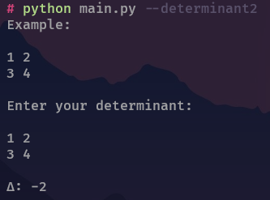
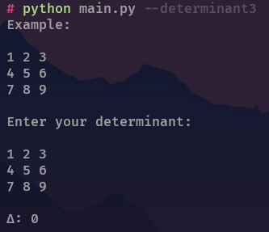
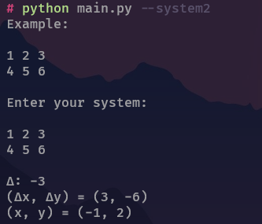
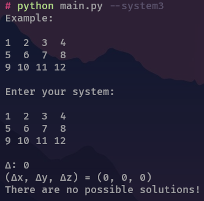

# DETERMINANT CALCULATOR

## Installing

```bash
python main.py -i
```
if that doesn't work try
```bash
pip install -r requirements.txt
```

## Usage

### Determinant 2D 

```bash
python main.py -d2
```
```bash
python main.py --determinant2
```


### Determinant 3D 

```bash
python main.py -d3
```
```bash
python main.py --determinant3
```


### System with 2 variables

```bash
python main.py -s2
```
```bash
python main.py --system2
```


### System with 3 variables

```bash
python main.py -s3
```
```bash
python main.py --system3
```

